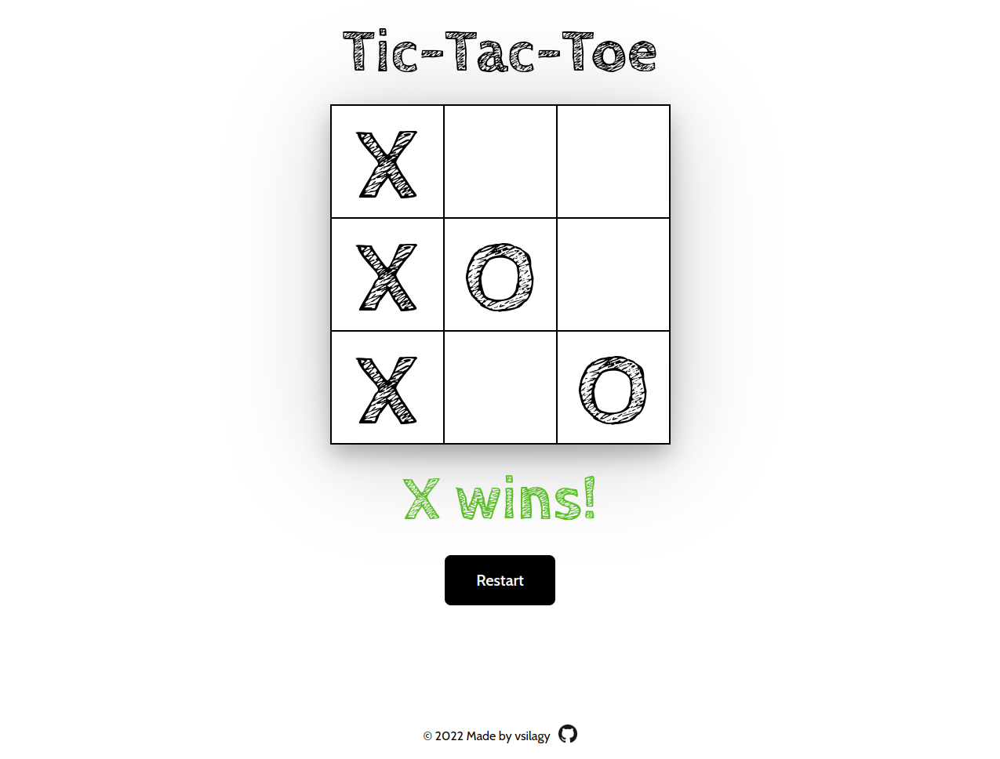

# Tic-Tac-Toe

[Live Preview](https://vsilagy.github.io/tic-tac-toe/)

### **The Odin Project** : [Tic-Tac-Toe Project](https://www.theodinproject.com/lessons/node-path-javascript-tic-tac-toe)

## Built with

### Technologies

 
    
     
     

## Objectives:

- build a tic-tac-toe gameboard as an array
- build the logic that checks for 3-in-a-row and a tie
- add restart button
