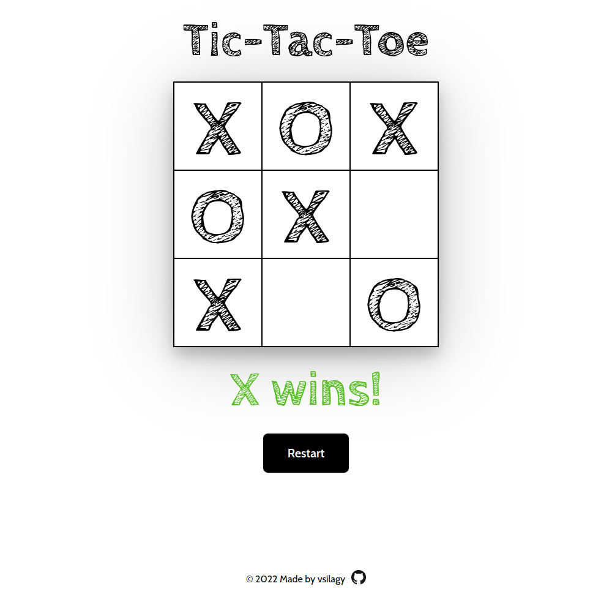

# Tic-Tac-Toe

A game of tic-tac-toe, player(X) vs player(O)

[Live Preview](https://vsilagy.github.io/tic-tac-toe/)

## Built with:

- HTML
- CSS
- JavaScript

### **The Odin Project**: [Tic-Tac-Toe Project](https://www.theodinproject.com/lessons/node-path-javascript-tic-tac-toe)

#### Objectives:

- build a tic-tac-toe game board as an array
- build the logic that checks for 3-in-a-row and a tie
- add restart button
